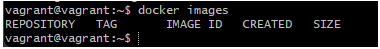

# Project-12: Containerization of Java Application using Docker

[*Project Source*](https://medium.com/r/?url=https%3A%2F%2Fwww.udemy.com%2Fcourse%2Fdecodingdevops%2Flearn%2Flecture%2F38184920%23overview)


## Pre-requisities:
* DockerHub account
* VirtualBox setup or AWS account to create a server to test


## Step-1: Overview of Base Images

- For Base images, we will go to DockerHub which is Container Image Repository.
- For our application we need five images for our services:
* MySQL (need to create customized image from base image)
* Memcached (we will use base image and override settings)
* RabbitMQ (we will use base image and override settings)
* Tomcat (need to create customized image from base image)
* Nginx (need to create customized image from base image)

## Step-2: Docker Hub Setup

- I will store the images in Docker Hub. If you don't have Docker Hub account, you can sign-up for free from the website `https://medium.com/r/?url=https%3A%2F%2Fhub.docker.com%2F`

## Step-3: Setup Docker Engine

- Create an Ubuntu machine with Vagrant to run Docker commands. First, create a new directory `docker-engine`.
- I will run `vagrant init bento/ubuntu-22.04` command which will create an Ubuntu 18.04 machine.

```sh
mkdir /c/docker-engine
cd /c/docker-engine/
vagrant init bento/ubuntu-22.04
```


- Give an IP address by updating Vagrantfile to access the VM. Uncomment the lines given below, which will create a Private network only host and a public network incase the private doesn't work ,to test in this VM. Also increase the RAM to 2gb depending on the RAM available on your computer.
```sh
vim Vagrantfile
### Uncomment the config.vm.network in the Vagrantfile like below ###
# Create a private network, which allows host-only access to the machine
# using a specific IP.
config.vm.network "private_network", ip: "192.168.56.36"

# Create a public network, which generally matched to bridged network.
# Bridged networks make the machine appear as another physical device on
# your network.
config.vm.network "public_network"

 config.vm.provider "virtualbox" do |vb|
  #   # Display the VirtualBox GUI when booting the machine
  #   vb.gui = true
  #
  #   # Customize the amount of memory on the VM:
     vb.memory = "2048"
   end
```

- Time to create the VM. And ssh into it.
```sh
vagrant up
vagrant ssh
sudo -i
```

- Go to official Docker Documentation website to get Docker installation steps for Ubuntu 22.04.
  Note: Ensure it is Docker Engine on Ubuntu and not Docker Desktop
  

  Follow the installation steps, once completed, run the below command
```sh
docker --version
```
- Add vagrant user to Docker group to be able to run docker commands.
  Once user is added, exit and log back in.
  Now we should be able to run docker commands successfully.
```sh
whoami
docker images
usermod -aG docker vagrant
id vagrant
exit
vagrant ssh
docker images
```



##  Step-4: Dockerfile References

- I will use VScode (any Text editor is fine) while creating my images. First I will fork the `vprofile-project` repository and clone the `containers` repository in the   same directory i created my Vagrantfile, this will enable quick test of the Docker images i  will create for my application services. https://github.com/devopshydclub/vprofile-project/tree/vp-rem
- Note: Ensure you switch to the branch `containers`
  Next checkout the branch `docker`. go to `Docker-files` directory, we will create our images under this directory.


- Create Repositories on DockerHub using the below properties
```sh
vprofileapp
vprofiledb
vprofileweb
```

## Step-5: Dockerfile for App Image[TOMCAT]
- Create an `app` directory under `Docker-files` directory. Copy the below content to a file named as `Dockerfile`.


```sh
FROM  openjdk:11 AS BUILD_IMAGE
RUN apt update && apt install maven -y
RUN git clone https://github.com/engrrichie/vprofile-project.git
RUN cd vprofile-project && git checkout docker && mvn install

FROM tomcat:9-jre11
LABEL "project"="vprofile"
LABEL "Author"="Yemi"
RUN rm -rf /usr/local/tomcat/webapps/*
COPY --from=BUILD_IMAGE vprofile-project/target/vprofile-v2.war /usr/local/tomcat/webapps/ROOT.war

EXPOSE 8080
CMD ["catalina.sh", "run"]
```

## Step-6: Dockerfile for DB Image[MYSQL]
- Create a `db` directory under `Docker-files` directory. Copy the content below to a file named as `Dockerfile`.
```sh
FROM mysql:8.0.33
LABEL "project"="vprofile"
LABEL "Author"="Yemi"

ENV MYSQL_ROOT_PASSWORD="vprodbpass"
ENV MYSQL_DATABASE="accounts"

ADD db_backup.sql /docker-entrypoint-initdb.d/db_backup.sql
```

- Copy db_backup.sql file from `src/main/resources` directory to `db` directory where DB Dockerfile exists.

## Step-7: Dockerfile for Web Image[NGINX]

- Create a `web` directory under `Docker-files` directory. Copy the content below to a file named as `Dockerfile`.
```sh
FROM nginx
LABEL "project"="vprofile"
LABEL "Author"="Yemi"

RUN rm -rf /etc/nginx/conf.d/default.conf
COPY nginvproapp.conf /etc/nginx/conf.d/vproapp.conf
```
- Create `nginxvproapp.conf` file under `web` directory with content below, and replace it in the container with default config file.
```sh
upstream vproapp{
  server vproapp:8080;
}
server{
listen 80;
location / {
 proxy_pass http://vproapp;
 }
}
```

## Step-8: Docker Compose

- Build and test the images using Docker compose
  Docker-compose.yml file

```sh
version: '3.8'
services:
  vprodb:
    build: 
       context: ./Docker-files/db
    image: yemiawsguru/vprofiledb
    container_name: vprodb
    ports:
      - "3306:3306"
    volumes:
      - vprodbdata:/var/lib/mysql
    environment:
      - MYSQL_ROOT_PASSWORD=vprodbpass
    
  vprocache01:
    image: memcached
    ports:
      - "11211:11211"

  vpromqear1:
     image: rabbitmq
     ports:
       - "15672:15672"
     environment:
      - RABBITMQ_DEFAULT_USER=guest
      - RABBITMQ_DEFAULT_PASS=guest

  vproapp:
    build: 
       context: ./Docker-files/app
    image: yemiawsguru/vprofileapp
    container_name: vproapp
    ports:
      - "8080:8080"
    volumes:
      - vproappdata:/usr/local/tomcat/webapps

  vproweb:
    build: 
       context: ./Docker-files/web
    image: yemiawsguru/vprofileweb
    container_name: vproweb
    ports:
      - "80:80"

volumes:
     vprodbdata: {}
     vproappdata: {}
```

## Step-9: Building Images

- We can check the files from our VM by executing commands below
```sh
vagrant reload
vagrant up
vagrant ssh
sudo -i
cd /vagrant/
ls
cd vprofile-project/
ls
```


- Build the images by executing commands below
```sh
vim docker-compose.yml
docker compose build
docker images
```

## Step-10: Run Containers & Test

- Go to the directory where we have our docker-compose.yml file and run command below:
```sh
docker compose up -d
docker ps
```


- Get the IP address of the VM
```sh
ip addr show
```


- log into validate the data base
```sh
username: Admin_vp
Password: Admin_vp
```


## Step-11: Push Images to Docker Hub

- Next, push the images to Docker Hub, but first login to Docker Hub with command below and provide username/password.
```sh
docker login
```

- Once we get a Login Successful message, we can push our images with commands below:
```sh
docker push <dockerhub_username>/vprofiledb
docker push <dockerhub_username>/vprofileapp
docker push <dockerhub_username>/vprofileweb
```

- We can check in our Docker Hub account from browser.


## Step-12:Clean up

- Clean both the images and containers using below commands
```sh
docker compose ps
docker compose down
docker system prune -a
```


